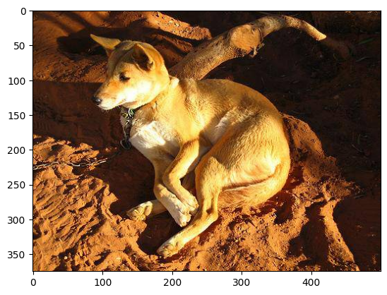

# Dog Breed Identification 🐾

Welcome to the Dog Breed Identification project! This is an exciting endeavor to accurately classify dog breeds using machine learning techniques. Whether you're a dog lover, a data enthusiast, or an AI enthusiast, you're in the right place.

## Table of Contents
- [About the Project](#about-the-project)
- [Getting Started](#getting-started)
- [Data](#data)
- [Usage](#usage)
- [Contributing](#contributing)
- [License](#license)

## About the Project

Do you ever wonder what breed that adorable dog you just met is? Our Dog Breed Identification project can help you with that! We've trained a powerful machine learning model using a vast dataset of dog images to recognize and classify dog breeds. This project showcases the beauty of AI and computer vision in action.

Key features:
- Accurate dog breed classification
- Easy-to-use web interface for breed identification
- Educational and fun for dog enthusiasts and techies alike

## Getting Started

Follow these simple steps to get started with Dog Breed Identification:

## Data

Our model was trained on a diverse dataset of dog images,Stanford Dog Breed Identification Datatset, including a wide variety of breeds with a total of 120 breed. The dataset used can be found here:(https://www.kaggle.com/datasets/jessicali9530/stanford-dogs-dataset)).

## Usage

1. Upload an image of a dog.
2. Click the "Identify Breed" button.
3. Let the magic happen! Our model will predict the breed of the dog in the image.

## Contributing
We welcome contributions from the community! Whether it's improving the model's accuracy, enhancing the web interface, or adding more dog breeds to the dataset, your contributions are valuable.

We hope you enjoy using Dog Breed Identification as much as we enjoyed creating it. If you have any questions, feedback, or suggestions, please don't hesitate to reach out. Happy dog breed identification! 🐶
